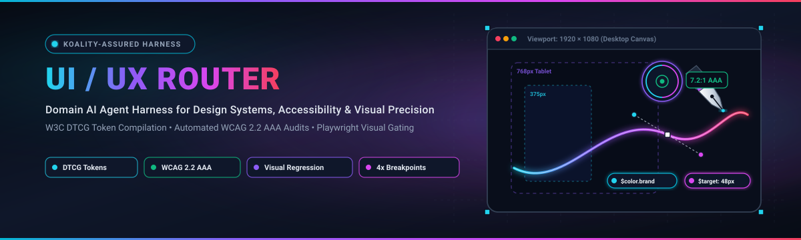
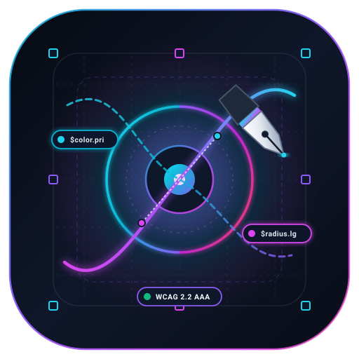
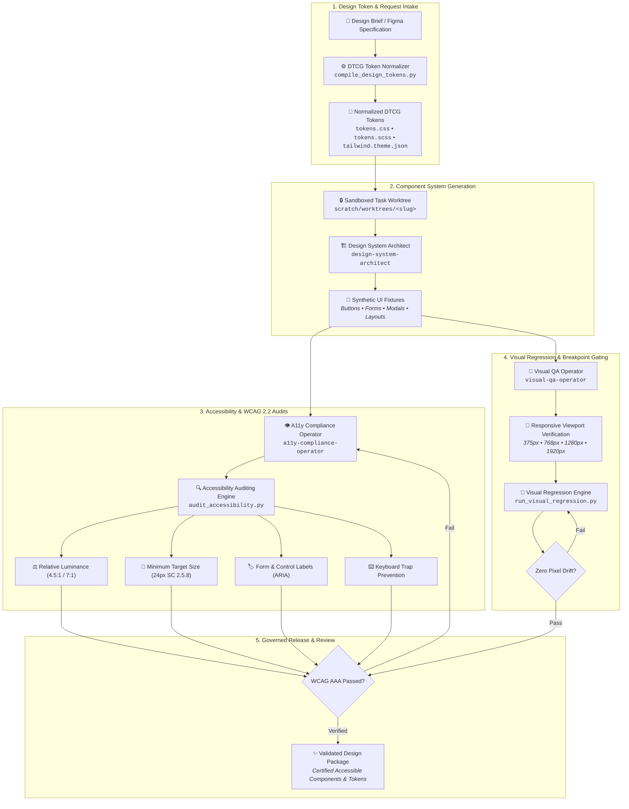

<div align="center">



<br/><br/>



# UI/UX Router

**Domain AI agent harness for design systems, WCAG 2.2 AAA accessibility conformance, visual regression, and design token management.**

[](https://github.com/Koality-Assured/ui-ux-router/actions/workflows/ci.yml)
[](LICENSE)
[](pyproject.toml)
[]()
[]()

</div>

---

## Mission Statement

**UI/UX Router** is the domain-specialized AI orchestration harness for interface engineering, design systems, digital accessibility conformance, and automated visual regression testing within the Koality-Assured ecosystem. It operates as a high-precision spoke decoupled from the core harness runtime, enforcing verifiable quality gates for user interfaces before any code reaches production.

UI/UX Router bridges modern design specifications and engineering delivery through four pillars:
1. **W3C DTCG Token Standardization**: Complete normalization, validation, and multi-format compilation of Design Tokens Community Group (DTCG) formats to CSS custom properties, SCSS variables, and Tailwind theme configuration.
2. **Deterministic WCAG 2.2 AAA Auditing**: Zero-dependency relative-luminance contrast calculation, touch target minimum sizing (SC 2.5.8), focus trap identification, and accessible name computation, paired with optional `axe-core` sweeps.
3. **Responsive Multi-Viewport Verification**: Layout overflow and touch target verification across mobile (375px), tablet (768px), desktop (1280px), and wide (1920px) viewport baselines.
4. **OS-Stable Visual Regression Gating**: Headless deterministic raster screenshot comparisons that eliminate cross-platform rendering jitter, motion blur, and font-swap flakiness.

---

## Core Capabilities

| Capability | Standard / Specification | Engine & Tooling | Verification & Quality Gate |
| :--- | :--- | :--- | :--- |
| **Design Token Normalization** | [W3C DTCG 2025.10 Format Module](./supporting/ui-ux/design-tokens-dtcg.md) | `scripts/ui-ux/compile_design_tokens.py` | Strict validation of `$value` and `$type`; rejects mixed legacy `value` keys; compiles to CSS, SCSS, and Tailwind |
| **Accessibility Auditing** | [W3C WCAG 2.2 Level AA / AAA](https://www.w3.org/TR/WCAG22/) | `scripts/ui-ux/audit_accessibility.py` + `@axe-core/cli` | Automated relative luminance contrast (>4.5:1 / >7:1), keyboard trap detection, unlabeled form inputs, target sizing |
| **Visual Regression Gating** | Deterministic Stdlib Raster & [Playwright](./supporting/ui-ux/playwright-visual-testing.md) | `scripts/ui-ux/run_visual_regression.py` | OS-stable pixel comparisons against baseline goldens; motion-freezing (`reduced-motion`) and font-lock gates |
| **Responsive Verification** | Mobile, Tablet, Desktop, Wide Layouts | Multi-viewport harness (375w, 768w, 1280w, 1920w) | Viewport overflow gating, minimum 24px touch target validation (WCAG SC 2.5.8), responsive breakpoint stability |

---

## Architecture & Operational Lifecycle

The UI/UX Router pipeline orchestrates design assets from raw specification to release-certified deliverable through sandboxed execution:



---

## Domain Specialist Agents

UI/UX Router provides four specialized domain agents configured in [`ai-tooling/agents/`](./ai-tooling/agents/) and [`docs/standards/ui-ux-overlay.md`](./docs/standards/ui-ux-overlay.md):

| Agent Identifier | Model Tier | Core Skill | Primary Responsibility |
| :--- | :--- | :--- | :--- |
| [`design-system-architect`](./ai-tooling/agents/design-system-architect/AGENT.md) | High | [`design-token-manage`](./ai-tooling/skills/ui-ux/design-token-manage/SKILL.md) | Token normalization, DTCG schema conformance, design token compilation, and theme architecture. |
| [`a11y-compliance-operator`](./ai-tooling/agents/a11y-compliance-operator/AGENT.md) | Standard | [`wcag-accessibility-audit`](./ai-tooling/skills/ui-ux/wcag-accessibility-audit/SKILL.md) | Automated WCAG 2.2 AA/AAA accessibility checks, contrast computation, ARIA labels, and keyboard traps. |
| [`visual-qa-operator`](./ai-tooling/agents/visual-qa-operator/AGENT.md) | Standard | [`visual-regression-audit`](./ai-tooling/skills/ui-ux/visual-regression-audit/SKILL.md) | Headless visual comparison, pixel-diff analysis against golden baselines, and layout stabilization. |
| [`interaction-designer`](./ai-tooling/agents/interaction-designer/AGENT.md) | Standard | [`responsive-breakpoint-verify`](./ai-tooling/skills/ui-ux/responsive-breakpoint-verify/SKILL.md) | Responsive layout testing across 375w, 768w, 1280w, and 1920w viewports and touch-target sizing. |

---

## Quickstart & Validation Commands

All tooling is runnable locally using Python 3.11+ without complex runtime prerequisites:

### 1. Design Token Compilation
Lint and compile DTCG design tokens to CSS custom properties, SCSS variables, and Tailwind snippets:

```bash
# Dry run verification of tokens
python scripts/ui-ux/compile_design_tokens.py --dry-run --json

# Compile tokens to build output directory
python scripts/ui-ux/compile_design_tokens.py --input scripts/ui-ux/fixtures/tokens/tokens.json --out-dir dist/tokens
```

### 2. Accessibility Auditing
Execute automated accessibility audits against component fixtures:

```bash
# Run stdlib synthetic accessibility audit (contrast, keyboard traps, unlabeled controls, target sizes)
python scripts/ui-ux/audit_accessibility.py --engine synthetic --json

# Run with custom failure threshold gates
python scripts/ui-ux/audit_accessibility.py --fail-on contrast,keyboard-trap

# Optional axe-core CLI run (when Node.js is installed)
python scripts/ui-ux/audit_accessibility.py --engine axe
```

### 3. Visual Regression Testing
Verify UI component stability against deterministic baselines:

```bash
# Dry-run headless synthetic comparison across 375, 768, 1280, 1920px viewports
python scripts/ui-ux/run_visual_regression.py --dry-run

# Run full visual regression check including responsive layout overflow validation
python scripts/ui-ux/run_visual_regression.py --check-layout --json

# Update committed golden baselines (when intentional design modifications occur)
python scripts/ui-ux/run_visual_regression.py --update-baselines
```

### 4. Harness & Repository Verification
Validate repository structure, markdown fast-checks, and full unit test suite:

```bash
# Compile kept Python modules
python -m compileall -q scripts .harness

# Execute comprehensive unit test suite
python -m unittest discover -s scripts/tests -v

# Run fast document and markdown structure validation
python scripts/docs/validate_structure_fast.py --all

# Run router structure and taxonomy validation
python scripts/docs/validate_router_structure.py

# Validate prompt caching and cost layer benchmarks
python scripts/cost-layers/validate_cost_layers.py
```

---

## Repository Architecture & Taxonomy

UI/UX Router is organized according to the canonical 12-area repository taxonomy:

```text
ui-ux-router/
├── AGENTS.md                 # Root normative contract, directive ranking, and cost rules
├── assets/                   # Vector branding assets (ui-ux-router-logo.svg, ui-ux-router-banner.svg)
├── routing/                  # Hybrid dispatch, area mapping, and skill catalogs
│   ├── areas.yaml            # Canonical 12-area repository taxonomy configuration
│   ├── AGENTS.md             # Routing hops and context-loading protocols
│   └── skill-dispatch.md     # Generated skill catalog with agent ownership and contracts
├── ai-tooling/               # Domain skills, specialist agents, A2A protocols, and memory scaffolds
│   ├── skills/ui-ux/         # DTCG token, accessibility, visual regression, and breakpoint skills
│   ├── agents/               # Specialist agent definitions (design-system-architect, a11y-compliance, etc.)
│   ├── a2a/                  # Agent-to-Agent communication schemas and cards
│   └── memory/               # Checkpoint partitions (user/, agent/, model/)
├── docs/                     # Authoritative engineering standards and domain specifications
│   ├── standards/            # ui-ux-overlay.md, context-management.md, harness-template.md
│   └── agent-session-security.md
├── scripts/                  # Automation engine, domain tooling, and validation
│   ├── ui-ux/                # audit_accessibility.py, compile_design_tokens.py, run_visual_regression.py
│   ├── routing/              # Hybrid dispatch, DAG resolver, and worktree spawn tooling
│   ├── cost-layers/          # ast-grep, Headroom, and prompt cache invariance checkers
│   └── tests/                # Comprehensive unit test suite
├── supporting/               # Tooling runtime guides and reference implementations
│   └── ui-ux/                # design-tokens-dtcg.md, axe-core-a11y-auditing.md, playwright-visual-testing.md
├── actionable/ projects/ research/ results/ scratch/ change-history/ # Managed lifecycle zones
└── pyproject.toml            # Project packaging specification and Python environment configuration
```

### Canonical 12-Area Taxonomy Summary

| Directory | Purpose & Operational Role |
| :--- | :--- |
| [`actionable/`](./actionable/) | **Human drop zone** — intake zone for human notes, UX requests, and design briefs. |
| [`ai-tooling/`](./ai-tooling/) | **Agent enablement** — skills, standalone agents, A2A interaction cards, and project memory. |
| [`change-history/`](./change-history/) | **Provenance log** — quarterly audit logs. Script-updated only; never loaded into agent context. |
| [`docs/`](./docs/) | **Authoritative knowledge** — design systems requirements, security MUST policies, and standards. |
| [`projects/`](./projects/) | **Initiative specifications** — initiative specs in slug folders (`projects/<slug>/README.md`). |
| [`references/`](./references/) | **External frameworks** — reference copies of standards (Conventional Commits, Markdown, etc.). |
| [`research/`](./research/) | **Topic deep-dives** — exploratory UI/UX investigations and accessibility evaluations. |
| [`results/`](./results/) | **Agent deliverables** — generated design artifacts, accessibility audit ledgers, and visual test reports. |
| [`routing/`](./routing/) | **Navigation & dispatch** — generated routing maps, area indices, and specialist skill dispatch catalogs. |
| [`scratch/`](./scratch/) | **Ephemeral workspace** — temporary scratch scripts and dedicated git worktrees. Never durable. |
| [`scripts/`](./scripts/) | **Automation engine** — tagged Python scripts for UI/UX testing, tokens, routing, and validation. |
| [`supporting/`](./supporting/) | **Tooling runtime guides** — durable patterns for tools (axe-core, DTCG, Playwright, Headroom, ast-grep). |

---

## Core ↔ Spoke Synchronization Protocol

UI/UX Router is a domain **spoke** connected to the generic upstream [`ai-harness-core`](https://github.com/Koality-Assured/ai-harness-core):

1. **Pull Core Updates**: Pull non-domain harness improvements while protecting UI/UX overlay files:
   ```bash
   python scripts/sync/pull_harness_core.py --dry-run --json
   ```
2. **Propose Generic Improvements**: Propose harness engine enhancements back to `ai-harness-core` (overlay paths are automatically excluded):
   ```bash
   python scripts/sync/propose_core_update.py --dry-run --json
   ```

---

## Security Notice

All agent interactions and pull requests adhere to strict session security boundaries. Redacted examples must be obviously fake. Never commit private tokens, API keys, credentials, or production PII. Full session security requirements are documented in [`docs/agent-session-security.md`](./docs/agent-session-security.md).

## License

UI/UX Router is open-source software licensed under the [MIT License](LICENSE). Copyright &copy; 2026 Koality-Assured.
